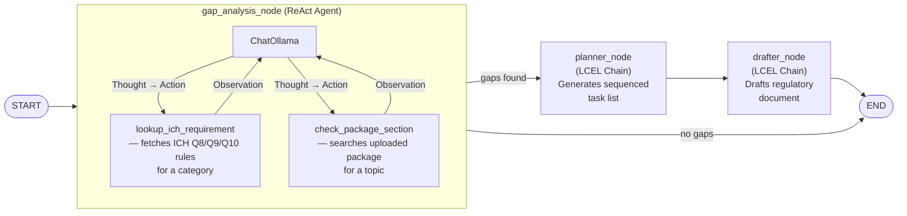

# TransferIQ

An agentic platform that automates the most document-intensive phase of pharmaceutical manufacturing — technology transfer. When a drug moves from one manufacturing site to another, the process generates hundreds of pages of compliance documents, weeks of expert review against ICH Q8/Q9/Q10 requirements, and significant regulatory risk. TransferIQ automates the core of it.

**Built with:** Python · LangGraph · LangChain · FastAPI · ChromaDB · Ollama · React 18 · TypeScript · Tailwind CSS

Part of a pharma AI portfolio covering the full drug development lifecycle — from autonomous drug discovery to late-stage manufacturing transfer.

---

## Demo

Video Demo - https://drive.google.com/file/d/1UnaI9-1UsbeNNC4mU-NLNsGVs6t9VNCy/view?usp=sharing

---

## Screenshots


---

## Features & Architecture

- **LangGraph StateGraph Orchestration:** The full transfer workflow runs as a stateful directed graph with conditional edges. If no gaps are found, the graph short-circuits to END. Each node is a specialised agent.
- **ReAct Gap Analysis Agent:** Uses `langchain.agents.create_agent` (LangChain v1) with two domain tools to reason through all six ICH Q8/Q9/Q10 compliance categories via a Thought → Action → Observation loop.
- **Regulatory Document Drafting:** Streams six document types (Technology Transfer Protocol, Risk Assessment, Validation Protocol, and more) token-by-token with per-section confidence scoring and one-click `.docx` export.
- **RAG Historical Context:** `nomic-embed-text` embeddings over synthetic historical transfer records in ChromaDB — surfaces the most similar past transfers by cosine similarity with outcomes and lessons learned.
- **Privacy-First by Design:** All inference runs locally via Ollama. No drug formulation data, batch records, or analytical methods leave the environment.
- **Real-Time SSE Streaming:** Gap analysis, document drafting, and the full pipeline stream results live via `fetch` + `ReadableStream`.

---

## Local Setup

**Prerequisites:** Python 3.11+ · Node.js 18+ · [Ollama](https://ollama.com)

```bash
ollama pull llama3.2
ollama pull nomic-embed-text
```

**Backend**
```bash
cd backend
python -m venv .venv && source .venv/bin/activate
pip install -r requirements.txt
uvicorn main:app --reload
# API:  http://localhost:8000
# Docs: http://localhost:8000/docs
```

On first start the backend automatically seeds four demo transfers, generates demo PDFs, and pre-warms the ChromaDB vector store. Subsequent restarts are instant.

**Frontend**
```bash
cd frontend
npm install && npm run dev
# App: http://localhost:5173
```

---

## Agent Architecture

### LangGraph StateGraph Pipeline



### Agent Patterns

| Pattern | File | Why this pattern |
|---------|------|-----------------|
| LangGraph StateGraph | `agents/transfer_graph.py` | Transfer workflow is a state machine — typed `TransferState`, conditional routing, not a hardcoded function sequence |
| ReAct Agent (`create_agent`) | `agents/gap_analysis.py` | Gap analysis requires deciding *which* ICH categories apply and *whether* the package addresses them — needs a reasoning loop, not a single prompt |
| Tool use (`@tool`) | `agents/gap_analysis.py` | Two callable tools give the LLM structured access to domain knowledge; tool calls and observations are recorded in the agent scratchpad |
| LCEL Chain (`prompt \| llm \| parser`) | `agents/planner.py`, `agents/drafter.py` | Planner and drafter are deterministic transforms — a reasoning loop adds no value here |
| RAG (ChromaDB + embeddings) | `agents/rag.py` | Semantic search over historical transfer outcomes — context no LLM has in its weights |
| LangSmith tracing | `tracing.py` | Env-var gated; captures every tool call, LLM hop, and agent step as a structured trace |
| POST-based SSE streaming | `main.py` | Long-running LLM calls stream live; `EventSource` only supports GET so uses `fetch` + `ReadableStream` |

---

## Where This Fits in the Drug Lifecycle

```
[Target ID] → [Lead Optimisation] → [Clinical Trials] → [Approval] → [Tech Transfer] → [Commercial Manufacturing]
                                                                              ↑
                                                                         TransferIQ
```

Most pharma AI work focuses on the left side — target identification, molecule design, clinical prediction. TransferIQ tackles the right side: once a drug is approved, moving it into commercial manufacturing is a multi-week, document-heavy compliance process that has seen almost no AI tooling.

---

## Demo Transfers

Four pre-seeded synthetic packages covering different formulation types and transfer complexities.

| Transfer | Route | Key Challenges |
|----------|-------|----------------|
| Metformin HCl 500mg Tablets | InnoPharm → BioMed CDMO | Post-approval site change · dissolution gap · incomplete long-term stability |
| Ibuprofen 400mg Film-Coated Tablets | Catalent → Lonza | BCS Class II · PSD instrument equivalence (Malvern vs Sympatec) · roller compaction scale-up |
| Sitagliptin Phosphate 100mg | Cambrex → Recipharm | Polymorphic form control · chiral HPLC transfer · XRPD capability gap · narrow LOD drying window |
| Valsartan 80mg Capsules | Fareva → Thermo Fisher | Amorphous API recrystallisation risk · nitrosamine (NDMA/NMBA) requirement · accelerated stability failure |

---

## Production Gaps

This is a proof of concept. A production deployment for a regulated CDMO would additionally require:

- **Auth & RBAC** — SSO (Azure AD / Okta) with roles: Author, QA Reviewer, Project Manager, Client
- **21 CFR Part 11 / EU Annex 11** — attributable electronic signatures, tamper-evident audit trail, GAMP 5 validation
- **Multi-tenancy** — complete data isolation between clients
- **LLM governance** — model version logging, change control on model updates, hallucination detection
- **eDMS integration** — approved documents belong in Veeva Vault or Documentum, not an app database
- **System integrations** — gaps should create CAPA actions in QMS; analytical data from LIMS not PDFs; tasks synced to ERP
- **Infrastructure** — SQLite → PostgreSQL; TLS, rate limiting, structured logging
